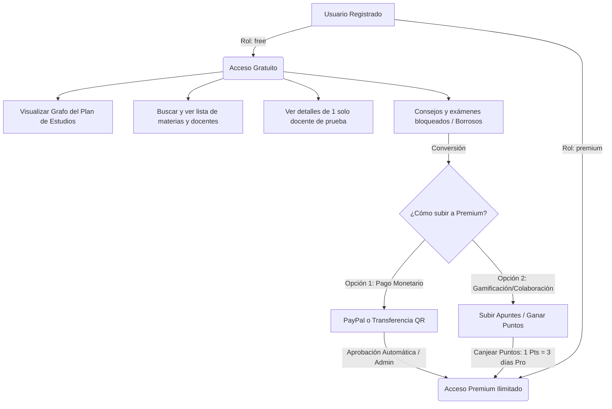

# PROYECTO ACADÉMICO COLABORATIVO FREEMIUM: "AYUDITA USFX"

---

## 1. Introducción

### El Comercio y los Negocios Digitales
El comercio, en su definición más fundamental, es la actividad socioeconómica que consiste en el intercambio de bienes o servicios por un valor equivalente (habitualmente monetario). Con la llegada de la era digital, este concepto ha evolucionado hacia el **comercio electrónico (e-commerce)** y los **modelos de negocios digitales**, donde los canales de distribución, la adquisición de clientes y la entrega de valor se realizan a través de internet. 

En la actualidad, el e-commerce no se limita a la venta de productos físicos; abarca también la distribución de bienes digitales, suscripciones de software (SaaS) e infoproductos (conocimiento, recursos educativos y asesoramiento). El comercio electrónico educativo y colaborativo representa una vertiente de alto crecimiento que monetiza el acceso a bases de conocimiento especializadas y herramientas de productividad académica.

### Resumen del Trabajo
El presente proyecto detalla el diseño, desarrollo e implementación de la plataforma web **"Ayudita USFX"** (`https://ayudita.up.railway.app`). Es un espacio digital colaborativo diseñado específicamente para la comunidad universitaria de la **Universidad Mayor, Real y Pontificia de San Francisco Xavier de Chuquisaca (USFX)** en Sucre, Bolivia. 

La plataforma opera bajo un **modelo de negocio freemium** y cuenta con pasarelas de pago integradas (PayPal y transferencias QR locales con validación administrativa). Su propósito principal es conectar a estudiantes de diversas carreras, permitiéndoles visualizar su plan de estudios de forma interactiva (representado como un grafo de dependencias de prerrequisitos), evaluar a los docentes en base a su experiencia real de cursada, y compartir consejos prácticos y recursos académicos (apuntes, proyectos, exámenes pasados) clasificados por materia y grupo.

### La Problemática que se Quería Resolver
En la USFX, al igual que en muchas universidades públicas de Bolivia, los estudiantes se enfrentan de forma recurrente a las siguientes problemáticas:
1. **Desorganización y falta de centralización de la información**: Los recursos de estudio (apuntes, exámenes de semestres anteriores, guías) se encuentran dispersos en grupos informales de WhatsApp, Telegram o carpetas personales de Google Drive que expiran o se pierden.
2. **Falta de información objetiva sobre docentes y grupos**: Al momento de inscribir asignaturas, los estudiantes no cuentan con un canal centralizado y confiable para conocer el método de enseñanza, la exigencia y la calidad didáctica de los docentes asignados a los diferentes grupos. Esto suele llevar a elecciones desacertadas que inciden directamente en el abandono de materias o la reprobación.
3. **Dificultad en el seguimiento del avance curricular**: Los mapas curriculares tradicionales (mallas en papel o PDF estáticos) dificultan al estudiante comprender qué asignaturas habilitará si aprueba una materia en específico, o qué prerrequisitos le bloquean el avance en semestres avanzados.
4. **Ausencia de incentivos para colaborar**: No existe una cultura o sistema gamificado que recompense a los estudiantes sobresalientes por compartir sus resúmenes y guías de estudio de calidad.

### Qué se Hizo
Para dar solución a estas necesidades, se implementó una plataforma web responsiva e interactiva basada en el framework **Laravel 12**. El sistema integra:
* Un **modelo relacional de base de datos** para gestionar carreras, asignaturas, docentes y la compleja red de prerrequisitos académicos.
* Un **visualizador de plan de estudios en forma de grafo dinámico** que reacciona al estado de aprobación del alumno.
* Un **paywall premium** que restringe el acceso a la lectura de consejos específicos y calificaciones completas de docentes para los usuarios de nivel "free", incentivando la suscripción a planes de pago (Bs. 10 mensual, Bs. 40 semestral, Bs. 70 anual).
* Un **sistema de gamificación por puntos**, donde los usuarios free pueden ganar puntos subiendo apuntes de valor. Estos puntos pueden canjearse por días de acceso Premium, permitiendo que la plataforma sea inclusiva para estudiantes que no disponen de recursos económicos pero aportan valor intelectual.
* Una **pasarela de pagos dual**: internacional a través de **PayPal SDK** y local a través de la subida y validación manual de **comprobantes de pago por Código QR**.
* Un **feed dinámico en la landing page** que recupera en tiempo real las últimas publicaciones de las redes sociales oficiales (Instagram y Facebook) mediante la API de Graph de Facebook, logrando una estética moderna y conectada.

### Pasos que se Siguieron para Llegar a este Punto
El desarrollo del proyecto se ejecutó en las siguientes fases:
1. **Fase de Análisis e Investigación**: Entrevistas con estudiantes de la USFX para identificar dolores en su vida académica cotidiana y análisis de los planes de estudio oficiales.
2. **Modelado de Base de Datos y Arquitectura**: Diseño de la base de datos relacional contemplando relaciones recursivas para prerrequisitos y tablas pivote para el estado de las materias del estudiante.
3. **Desarrollo del Core Backend**: Creación de los modelos de Laravel, controladores, factories y seeders para poblar el sistema con datos de prueba realistas (Ingeniería de Sistemas y Derecho).
4. **Diseño de Interfaz de Usuario (UI/UX)**: Implementación de un tema oscuro de alto nivel visual (glassmorphic), utilizando la tipografía moderna *Space Grotesk*, con colores contrastantes y micro-animaciones en Tailwind CSS.
5. **Implementación de Lógica Freemium y Paywall**: Desarrollo de middleware de protección, vistas difuminadas (blur) para incentivar la conversión, integración del SDK de PayPal, formulario de subida de capturas QR y sistema de canje de puntos académicos.
6. **Optimización SEO y Metadatos**: Ajuste estricto del favicon para visualización en Google Search, inserción de datos estructurados JSON-LD (FAQPage, WebSite, WebApplication, Organization) y configuración de `sitemap.xml` y `robots.txt` para asegurar un posicionamiento orgánico óptimo.
7. **Despliegue y Pruebas**: Publicación de la aplicación en la plataforma cloud **Railway**, configuración de variables de entorno y pruebas unitarias/de integración automatizadas.

### URL del Trabajo
La plataforma se encuentra desplegada y operativa en producción en la siguiente dirección:
* **Enlace Oficial**: [https://ayudita.up.railway.app](https://ayudita.up.railway.app)

### Resultados Obtenidos
* **Plataforma Integral Funcionando**: Un sitio web rápido, responsivo y completamente securizado.
* **Sistema de Monetización Activo**: Integración exitosa con PayPal para suscripciones automáticas en dólares y pasarela QR para depósitos directos en Bolivianos (Bs.).
* **Indexación y SEO Correctos**: Estructura meta-etiquetada correctamente para redes sociales (Open Graph / Twitter Cards con imágenes absolutas) y optimización de favicon para evitar el icono genérico en Google Search.
* **Comunidad Motivada**: Un canal donde los estudiantes adquieren acceso premium ya sea pagando una tarifa muy económica o colaborando con material didáctico de calidad, creando un círculo virtuoso de aprendizaje.

---

## 2. Antecedentes

### Contexto del Mercado Global
En el ámbito internacional, existen plataformas orientadas a la evaluación de docentes y recopilación de apuntes. Sitios como **MisProfesores.com** (en América Latina), **RateMyProfessors.com** (en países de habla inglesa) o **Wuolah** (en España) demuestran que existe una demanda masiva por parte de los estudiantes para acceder a información transparente sobre sus profesores y conseguir apuntes de calidad. Sin embargo, estas soluciones globales presentan grandes vacíos:
* No se adaptan a la estructura académica formal de cada universidad (planes de estudios específicos, códigos oficiales de asignaturas, grupos específicos).
* La monetización suele basarse en publicidad invasiva o suscripciones costosas en monedas extranjeras, inaccesibles para el estudiante promedio boliviano.
* No vinculan el progreso curricular (materias aprobadas/cursando) con las recomendaciones que recibe el usuario.

### Antecedentes en Sucre, Bolivia
En la ciudad de Sucre, sede de la prestigiosa **Universidad Mayor, Real y Pontificia de San Francisco Xavier de Chuquisaca** (que alberga a más de 50,000 estudiantes), la compartición de recursos y la evaluación de docentes históricamente se ha dado de forma analógica e informal:
1. **Fotocopiadoras Locales**: Cerca de las facultades (como Tecnología, Derecho, Medicina), las fotocopiadoras almacenaban carpetas físicas llamadas "archivadores de exámenes pasados". Los estudiantes debían acudir presencialmente, buscar hojas mal fotocopiadas y pagar por su impresión.
2. **Grupos de WhatsApp y Google Drive**: Con la digitalización acelerada por la pandemia, los centros de estudiantes y alumnos particulares crearon enlaces de Google Drive con exámenes y prácticas. Estos enlaces suelen corromperse, llenarse de spam, borrarse por derechos de autor o quedar desactualizados. Además, no existe un método de búsqueda filtrada por materia o docente.
3. **Recomendaciones de Boca en Boca**: La elección de grupos y docentes se decide mediante consultas directas a amigos de semestres superiores o publicaciones en grupos masivos de Facebook de la universidad ("Alguien sabe qué tal enseña el Ing. X?"). Esto produce respuestas sesgadas, subjetivas y dispersas que no ayudan al resto de la comunidad en el futuro.
4. **Intenciones Previas de Digitalización**: Se registraron intentos de crear foros estudiantiles o blogs en WordPress por parte de agrupaciones políticas universitarias, pero todos fracasaron debido a la falta de un modelo de negocio sostenible que cubriera los costos de servidor y dominio, y a la ausencia de un diseño atractivo e interactivo que retuviera a los estudiantes.

**Ayudita USFX** se erige como la primera solución formal, estructurada y económicamente viable en Sucre que profesionaliza esta necesidad, entregando un producto moderno hecho por y para estudiantes de la USFX.

---

## 3. Objetivos

### Objetivo General
Desarrollar, desplegar y optimizar una plataforma web académica y colaborativa basada en un modelo de negocio freemium, diseñada específicamente para los estudiantes de la Universidad de San Francisco Xavier de Chuquisaca (USFX), que centralice la información curricular, promueva el intercambio de recursos didácticos de calidad e integre pasarelas de pago digitales y mecanismos de gamificación para asegurar su autosustentabilidad.

### Objetivos Específicos
1. **Modelar una estructura de datos académica robusta** en MySQL que refleje fielmente las relaciones jerárquicas y de dependencia (carreras, asignaturas, docentes, grupos y prerrequisitos curriculares).
2. **Crear una interfaz de usuario interactiva y de alta calidad visual (Premium UI)** con soporte adaptativo para dispositivos móviles, empleando Tailwind CSS, AlpineJS y la tipografía de diseño Space Grotesk.
3. **Desarrollar un visor dinámico de plan de estudios en forma de grafo interactivo** que permita a los estudiantes visualizar de manera clara e intuitiva su progreso académico y las asignaturas que tienen habilitadas o bloqueadas.
4. **Implementar un sistema de control de accesos y roles (Free, Premium y Administrador)** que restrinja el contenido de valor (consejos específicos, exámenes resueltos y calificaciones docentes completas) para incentivar la compra de suscripciones.
5. **Integrar una pasarela de pagos internacional (PayPal)** y una **pasarela de pagos local (Código QR)** con una interfaz administrativa para validar de manera rápida los comprobantes de depósito bancario subidos por los usuarios.
6. **Implementar un módulo de gamificación** basado en la asignación de puntos a los usuarios que compartan recursos valiosos, permitiendo el canje de puntos por días premium de forma 100% automatizada.
7. **Aplicar técnicas avanzadas de Optimización SEO y Redes Sociales**, incluyendo sitemaps estructurados, marcado JSON-LD en formato PHP robusto y metatags Open Graph dinámicos con imágenes absolutas.

---

## 4. Herramientas Utilizadas

La plataforma **Ayudita USFX** fue construida utilizando un ecosistema tecnológico moderno, robusto y escalable, evitando el uso de gestores de contenido limitados (CMS) y optando por desarrollo de software a medida.

| Categoría | Herramienta / Tecnología | Versión | Descripción y Uso en el Proyecto |
| :--- | :--- | :--- | :--- |
| **Framework Backend** | Laravel | 12.0.x | Motor principal de la aplicación. Gestiona rutas, controladores, ORM Eloquent, migraciones y vistas Blade. |
| **Motor de Base de Datos** | MySQL | 8.0+ | Almacenamiento relacional de datos de usuarios, perfiles, docentes, carreras, materias y transacciones de pago. |
| **Lenguaje de Programación** | PHP | 8.2+ | Lenguaje en el que está escrito el backend de Laravel, aprovechando el tipado estricto y mejoras de rendimiento. |
| **Compilador de Assets** | Vite | 7.0.x | Herramienta de compilación rápida para optimizar el Javascript y CSS del lado del cliente. |
| **Diseño y Estilos (CSS)** | Tailwind CSS | 3.1.0 / 4.0 | Framework CSS utilizado para construir la interfaz oscura (Dark Mode), tarjetas translúcidas (glassmorphism) y grillas responsivas. |
| **Interactividad Frontend** | AlpineJS | 3.4.x | Framework JS ultraligero utilizado para controlar estados locales como apertura de modales, pestañas de pago y menús móviles. |
| **Pasarela Internacional** | SDK Smart Buttons de PayPal | v2 | Botones interactivos de PayPal integrados en el frontend que procesan transacciones de suscripción en USD. |
| **Pasarela Local** | Pago con QR y Almacenamiento S3/Local | - | Generación de imagen QR estática (`qr.jpeg`) para transferencias directas y procesamiento de subidas de imágenes de comprobantes. |
| **Seguridad y Roles** | Laravel Breeze | 2.4.x | Paquete oficial para el andamiaje rápido y seguro del login, registro, verificación de email y recuperación de contraseñas. |
| **Pruebas y QA** | PHPUnit | 11.5.x | Suite de pruebas unitarias y de integración automáticas para validar controladores, APIs y migraciones. |
| **SEO y Metadatos** | JSON-LD y Open Graph | - | Datos estructurados para Google Search y metadatos dinámicos vinculados con imágenes absolutas optimizadas (`og-image.png`). |
| **Tipografía** | Space Grotesk (Google Fonts) | - | Fuente de diseño sans-serif futurista y de alta legibilidad que otorga la identidad premium al sitio. |
| **Despliegue / Cloud** | Railway | - | Hosting en la nube que ejecuta los contenedores de la app, base de datos MySQL y balanceadores de carga en producción. |

---

## 5. Modelo de Ingresos (Freemium Business Model)

La viabilidad financiera del proyecto se basa en un **modelo de ingresos Freemium**, estructurado para captar una amplia base de usuarios gratuitos y convertir un porcentaje de ellos en suscriptores de pago gracias a un embudo de conversión diseñado en base a las necesidades de estudio del alumno.



### Tabla de Comparación de Planes

| Característica / Beneficio | Plan Gratuito (Free) | Plan Premium (Pro) |
| :--- | :---: | :---: |
| **Costo** | Bs. 0 | Bs. 10 (Mensual) / Bs. 40 (Semestral) / Bs. 70 (Anual) |
| **Visualización del Grafo de Estudios** | Sí (Ilimitado) | Sí (Ilimitado) |
| **Búsqueda de Asignaturas** | Sí | Sí |
| **Listado de Docentes** | Sí | Sí |
| **Ficha de Detalle de Docentes** | Solo el primero (Preview) | Todos los docentes de la carrera |
| **Calificaciones y Comentarios de Docentes** | Bloqueado / Redirección al paywall | Acceso ilimitado a reseñas de alumnos |
| **Consejos de Estudio por Materia** | Bloqueado (Estilo Borroso/Blur) | Lectura completa y detallada de tips |
| **Descargas de Proyectos y Exámenes Pasados** | Bloqueado | Descargas ilimitadas de archivos adjuntos |
| **Soporte prioritario** | No | Sí |

### Detalles del Flujo de Gamificación (Puntos de Colaboración)
Para evitar la exclusión de estudiantes de bajos recursos, se diseñó un canal alternativo para adquirir la suscripción Pro mediante el aporte de valor a la comunidad:
* Un estudiante sube un recurso académico de calidad (ej. un examen resuelto o un resumen de la materia).
* El administrador aprueba el recurso desde su panel de control y asigna puntos al estudiante (ej. 5 o 10 puntos).
* El usuario acumula los puntos en su perfil.
* **Tasa de Canje**: **1 Punto = 3 días Pro**.
* **Condición de Canje**: Mínimo 10 puntos (equivalente a 30 días de suscripción Pro).
* Al presionar "Canjear Puntos", el sistema descuenta automáticamente los puntos y extiende la fecha de expiración premium (`premium_until`) del usuario sin requerir transacciones bancarias.

---

## 6. Descripción Detallada del Sitio e Interfaces

La interfaz de usuario de **Ayudita USFX** se rige bajo un lenguaje visual oscuro de alto nivel de fidelidad (estilo *Premium SaaS*). Se construyó con un esquema de diseño oscuro unificado en [app.blade.php](file:///c:/Users/david/Documents/Comercio/Pagina/resources/views/layouts/app.blade.php) y [guest.blade.php](file:///c:/Users/david/Documents/Comercio/Pagina/resources/views/layouts/guest.blade.php) usando la tipografía geométrica **Space Grotesk** para el texto principal y la fuente monoespaciada de Google para indicadores o códigos de asignaturas. 

A continuación, se describen detalladamente cada uno de los módulos de la aplicación, sus interfaces y su lógica funcional subyacente.

---

### A. Módulos y Experiencia del Estudiante (Usuario Final)

#### 1. Flujo de Registro Inteligente con Autofill de Prerrequisitos (Onboarding)
*   **Interfaz**: Un formulario estructurado en varios bloques en la vista de registro. Además de los datos estándar de acceso (Nombre, Correo, Contraseña), requiere de manera obligatoria la carrera (seleccionada mediante un menú desplegable de carreras disponibles), el Semestre Actual (1 al 12), la Cédula de Identidad (CI), y el Carnet Universitario (CU).
*   **Funcionalidad Destacada (Autoselección de Historial)**: Al seleccionar la carrera, se carga la lista de materias habilitadas para cursar. El estudiante marca las asignaturas que está cursando actualmente en su semestre y selecciona el grupo correspondiente.
*   **Algoritmo de Relleno por Prerrequisitos (Búsqueda en Anchura - BFS)**:
    *   Para evitar que el estudiante tenga que marcar manualmente todas las materias que ya aprobó en semestres anteriores, el backend ejecuta un algoritmo de búsqueda recursiva (BFS) a partir de las materias indicadas como "cursando".
    *   El sistema busca de forma recursiva hacia atrás en la tabla `requisitos_materias` para extraer todos los ancestros (prerrequisitos) requeridos.
    *   **Ejemplo**: Si el usuario registra que está cursando *Bases de Datos I (SIS-311)*, el sistema detecta que su prerrequisito es *Algoritmos (SIS-211)*, y el prerrequisito de este es *Programación I (SIS-111)*.
    *   Automáticamente, en la tabla pivote de progreso académico (`materia_user`), el sistema registra *Algoritmos* y *Programación I* con el estado `'aprobada'`.
    *   **Validación de Conflicto**: El controlador de registro valida que el usuario no haya marcado una materia como cursando y al mismo tiempo uno de sus prerrequisitos como cursando. Si esto ocurre, se lanza una excepción de validación que se muestra en la interfaz impidiendo el envío.

#### 2. Landing Page y Feed de Redes Dinámico
*   **Interfaz**: Una portada moderna con cabecera oscura fija, tarjetas translúcidas de planes de suscripción (Mensual, Semestral, Anual) con bordes iluminados por gradientes lineales.
*   **Funcionalidad de Feed Integrado**:
    *   Usa el SDK HTTP de Laravel para consumir los endpoints `/media` de Instagram Business y `/feed` de Facebook Pages de la Graph API de Meta.
    *   Agrupa las publicaciones en un único array unificado, las ordena de forma descendente usando la marca de tiempo (timestamp) de creación, y las muestra en la sección de novedades.
    *   Cuenta con un sistema de caché de 30 minutos para evitar saturar el límite de peticiones de la API de Meta y garantizar un tiempo de respuesta de la landing page inferior a 200 ms.

#### 3. Dashboard Principal
*   **Interfaz**: Un panel de control bento-grid con tarjetas adaptativas. Muestra un banner personalizado que saluda al usuario, indica su rol actual (`free` o `premium`), su fecha de expiración si es Pro, y el saldo de puntos acumulados en su perfil de gamificación.
*   **Funcionalidad**: Lista dinámemante las materias que el estudiante está cursando en el semestre actual. Al hacer clic en cualquiera de ellas, lo redirige directamente a la comunidad de esa asignatura. También cuenta con accesos directos rápidos hacia el Grafo interactivo y el Directorio de Docentes.

#### 4. Canvas Interactivo del Plan de Estudios (Grafo de Progreso)
*   **Interfaz**: Un lienzo infinito similar a la mesa de trabajo de herramientas de diseño como Figma. Cuenta con un fondo gris con cuadrícula de puntos (`canvas-dot-grid` mediante gradiente radial en CSS) y controles flotantes (HUD Panels) para Zoom (+ / - / Reset), Leyenda de estados y título de la carrera.
*   **Funcionalidad Frontend (Canvas Engine)**:
    *   **Zoom & Pan con Cursor**: Escrito en JavaScript nativo. El usuario puede mover el lienzo haciendo arrastre con el mouse (grab & drag) y hacer zoom in/out utilizando la rueda del ratón (centrado de forma exacta sobre la posición del puntero) o usando los botones del HUD.
    *   **Renderizado de Carriles**: Las asignaturas se organizan automáticamente en columnas verticales correspondientes a su semestre.
    *   **Renderizado de Conexiones SVG**: Al cargar el grafo, un script calcula de forma matemática las coordenadas `(x, y)` del borde de salida de las materias prerrequisito y el borde de entrada de las materias dependientes, y dibuja curvas Bezier fluidas utilizando un elemento `<svg>` absoluto que actúa como capa de fondo.
    *   **Efecto Neural Interact**: Al pasar el cursor o hacer clic sobre una materia, JavaScript resalta la materia seleccionada, ilumina en color rojo coral (`#ffb4ab`) las líneas y tarjetas de sus prerrequisitos (de dónde viene), en color púrpura oscuro (`#842bd2`) sus materias dependientes (hacia dónde va), y atenúa a un 15% de opacidad (`opacity-15`) el resto del mapa para evitar la sobrecarga cognitiva.
    *   **Estados de Materias**: Las tarjetas reflejan de forma visual el progreso:
        *   *Vencidas (Aprobadas)*: Borde verde esmeralda y fondo con sombra suave verde.
        *   *Cursando*: Icono indicador con anillo de pulso animado en color azul cielo.
        *   *Habilitadas*: Tarjetas con bordes grises y texto legible, listas para cursar.
        *   *Bloqueadas*: Icono de candado que avisa que aún faltan vencer sus materias previas.
*   **Paywall de Grafo**: Los usuarios gratuitos tienen acceso de visualización libre por 5 segundos para interactuar con el mapa. Al cumplirse el tiempo, un trigger automático abre el modal del Paywall Premium impidiendo su cierre a menos que regrese al dashboard base.

#### 5. Muro Académico de la Materia (Show Materia)
*   **Interfaz**: Se divide en una cabecera con los datos oficiales de la materia (código, carrera, obligatoriedad) y una tarjeta con la foto y calificación promedio del docente del grupo correspondiente. Abajo, se despliega un sistema de pestañas (Tabs) controlado por JS para alternar entre "Consejos y Recomendaciones" y "Archivos y Recursos".
*   **Funcionalidad (Aportes e Interacciones)**:
    *   **Formulario de Aportación Colaborativa**: Un panel desplegable que permite subir un aporte. Si el tipo de recurso es un archivo (PDF, JPEG, PNG de hasta 10MB), el usuario debe seleccionar obligatoriamente una etiqueta académica ("Primer Parcial", "Segundo Parcial", "Examen Final", "Laboratorio" o "Práctica") para catalogar el examen o apunte.
    *   **Filtros de Búsqueda Dinámicos**: Permite filtrar las tarjetas de consejos en tiempo real mediante un buscador de texto (que evalúa el contenido, el autor y la etiqueta), pills de categorías (Consejos, Exámenes, Apuntes, Otros) y selectores de rango de fecha de publicación.
    *   **Gamificación de Votos**: Integración de botones Upvote/Downvote mediante peticiones AJAX utilizando la API Fetch. Al presionar "Me gusta", se incrementa el contador de la tarjeta en tiempo real sin recargar la página. Si un aporte tiene muchos votos positivos, el administrador puede marcarlo como "Verificado" (añadiendo un sello dorado visual).
    *   **Bloqueo Base (Paywall Blur)**: Para usuarios gratuitos, la lista de consejos y archivos adjuntos se renderiza con la propiedad Tailwind `blur-[8px] select-none pointer-events-none`. Esto genera curiosidad y alta conversión al ver de forma borrosa que existen múltiples exámenes resueltos y apuntes listos para descargar.

#### 6. Directorio de Docentes y Calificaciones
*   **Interfaz**: Un buscador de docentes que incluye tarjetas de biografía, estrellas de calificación promedio del 1 al 5 y las materias en las que dicta clase.
*   **Funcionalidad**:
    *   **Filtro "Mis Docentes"**: Un interruptor que evalúa las materias inscritas del estudiante en la base de datos y filtra al instante el directorio para mostrar únicamente a los profesores que le dictan clases este semestre.
    *   **Restricción de Reseña**: Un estudiante solo puede escribir un comentario y calificar (1 a 5) a un docente si está cursando activamente una materia con él en el grupo asignado. Esto protege la reputación del plantel docente contra campañas de desprestigio o spam.
    *   **Paywall Direct**: Los usuarios gratuitos solo pueden ver los comentarios y la ficha completa del primer docente en orden alfabético (a modo de demostración). Al hacer clic en cualquier otro profesor del listado, el sistema interrumpe la navegación y abre el modal Pro.

---

### B. Módulos y Experiencia del Administrador (Vendedor)

#### 1. Panel de Control y Métricas Básicas
*   **Interfaz**: Dashboard administrativo oscuro con estadísticas de registro en tiempo real: total de usuarios, usuarios premium activos, porcentaje de conversión de free a pro, y notificaciones de comprobantes de pago QR pendientes de validar.

#### 2. Importador de Mallas Curriculares y Prerrequisitos en Lote
*   **Interfaz**: Un módulo dentro de la administración de carreras que presenta un selector de archivos `.json` y un área de texto para pegado directo de código JSON.
*   **Procesamiento en Dos Fases**:
    *   *Fase 1 (Sube materias)*: El script lee el JSON, limpia campos y procesa cada nodo. Utiliza expresiones regulares (`preg_match`) para convertir textos de cursos académicos como `"1º semestre"` en un valor entero `1`. Realiza una inserción o actualización masiva (`updateOrCreate`) en la tabla `materias` usando la sigla oficial.
    *   *Fase 2 (Enlaza prerrequisitos)*: Una vez creadas todas las materias en la base de datos, el script realiza una segunda pasada sobre el JSON. Busca las siglas de prerrequisitos declaradas en el archivo, extrae sus IDs generados y realiza un método `.sync()` de Laravel en la relación de muchos a muchos de prerrequisitos, poblando la tabla `requisitos_materias` en segundos sin riesgo de inconsistencias de llaves foráneas.

#### 3. Control y Aprobación de Pagos QR
*   **Interfaz**: Bandeja de entrada que lista los depósitos por código QR en estado `pending`.
*   **Funcionalidad**:
    *   El administrador visualiza la captura de pantalla del comprobante subida por el estudiante y los datos del plan (mensual, semestral o anual) y monto pagado (Bs. 10, 40 o 70).
    *   **Aprobación**: Si el pago es válido, presiona "Aprobar". El backend modifica el rol del usuario a `premium`, calcula la fecha de expiración sumando `addMonth()`, `addMonths(6)` o `addYear()` a la hora actual (`Carbon::now()`), guarda los cambios y actualiza el estado del registro QR a `approved`.
    *   **Rechazo**: Si el comprobante es ilegible o falso, el administrador presiona "Rechazar" y debe llenar obligatoriamente un campo de texto detallando el motivo. El backend cambia el estado de la transacción a `rejected` y guarda el motivo en la columna `mensaje_admin`, la cual se mostrará al usuario final en color rojo en su pantalla de Paywall para que pueda corregir el archivo y volver a intentarlo.

---

### C. Capturas de Pantalla (Estructura y Mockups Visuales)

*A continuación se detallan las estructuras visuales implementadas en los layouts clave del proyecto:*

#### Estructura de la Tarjeta Paywall Integrada (Paywall UI)
```
+-----------------------------------------------------------------------------+
|  [Logo Ayudita]   AYUDITA PRO - Desbloquea Todo Tu Potencial                 |
|  * Acceso ilimitado a exámenes y guías de estudio                           |
|  * Descargas completas de proyectos y códigos fuente                        |
|  * Consejos exclusivos de estudiantes destacados                            |
|                                                                             |
|  +-----------------------------------------------------------------------+  |
|  | ELIGE TU PLAN:                                                        |  |
|  | [X] Plan Mensual:   Bs. 10 / mes    (Ideal para probar)                |  |
|  | [ ] Plan Semestral: Bs. 40 / 6m     (Ahorra 33% - Recomendado)        |  |
|  | [ ] Plan Anual:     Bs. 70 / año    (Ahorra 41% - Máximo valor)       |  |
|  +-----------------------------------------------------------------------+  |
|                                                                             |
|  PAGO SELECCIONADO: Bs 10                                                   |
|  +-------------------------------------+---------------------------------+  |
|  |             PAYPAL                  |            PAGO QR              |  |
|  | [ Botón de Pago PayPal Express ]     | Escanea el código para pagar:   |  |
|  |                                     |    [Imagen Código QR Estático]  |  |
|  |                                     | Subir Comprobante (File Input)  |  |
|  |                                     | [ Enviar Comprobante (Botón) ]  |  |
|  +-------------------------------------+---------------------------------+  |
|                                                                             |
|  CANJEAR PUNTOS:                                                            |
|  Tienes 15 Puntos Acumulados.                                               |
|  [ Canjear 15 Puntos por 45 días Pro (Botón Púrpura) ]                      |
+-----------------------------------------------------------------------------+
```

#### Estructura Visual del Bloqueo por Desenfoque (Blur Effect)
Para incentivar el registro Premium de forma no intrusiva, las secciones con valor como los "Consejos de Materia" lucen de la siguiente manera para un usuario gratuito:

```
+-----------------------------------------------------------------------------+
| CONSEJOS DE LA ASIGNATURA: ALGORITMOS Y ESTRUCTURAS DE DATOS                |
|                                                                             |
| +-------------------------------------------------------------------------+ |
| |  [!] SECCIÓN PREMIUM BLOQUEADA                                          | |
| |  Para ver los 8 consejos prácticos de estudiantes de semestres          | |
| |  anteriores, debes contar con una suscripción Pro activa.               | |
| |  [ Ver Planes Premium ] <- Botón                                        | |
| +-------------------------------------------------------------------------+ |
|                                                                             |
| ####### CONSEJO DE ALEJANDRO CONDORI (Fecha: 12/06/2026) #########          |
| Estudiar lxx xxxxx xx xxxxxxxxxxx y xxxxxxxxxx. El xxxxxx xxxxxxx xx xxx    |
| xxxxxxxxxx xx la xxxxxxx. Hxxxx xxx xxxxxxxxx xx xxxxx.                     |
|                                                                             |
| ####### CONSEJO DE MARIANA FLORES (Fecha: 15/06/2026) ############          |
| Cxxxxxxx xxx xxxxxxxxx xxxxxxxxxx xx C++ xxxxx xx xxx xxxxxxxxxx.           |
| Nxx xxxxxxx lxx xxxxxx xx xxxxxxx. El xxxxxxx xxxxx xxxxx.                  |
+-----------------------------------------------------------------------------+
```
*(Nota: El texto de fondo se renderiza de forma difusa mediante la clase Tailwind `blur-[8px]`, impidiendo su lectura por completo pero confirmando visualmente al estudiante que el contenido existe y está disponible tras suscribirse).*

---

## 7. Conexión con Redes Sociales

Un canal fundamental para la adquisición de usuarios e interacción de la comunidad son las redes sociales de la plataforma. Para mantener el sitio web fresco e informativo, se implementó una **integración técnica de doble vía**:

1. **Consumo Dinámico de Feeds a través de API**:
   * Se configuró un controlador que se comunica directamente con la **API de Facebook Graph (versión 20.0)**.
   * **Instagram**: La app extrae las últimas 3 publicaciones del perfil de Instagram Business (`services.instagram.business_id`) incluyendo la imagen de portada, el pie de foto (caption), la fecha y el enlace directo (permalink).
   * **Facebook**: Recupera las últimas 3 publicaciones del feed de la página oficial de Facebook (`services.instagram.page_id`) con su texto e imágenes de alta resolución.
   * **Optimización de Caché**: Dado que las llamadas a la API de Facebook pueden retrasar el tiempo de carga de la página de inicio, las publicaciones recuperadas se almacenan en el sistema de Caché de Laravel por **1800 segundos (30 minutos)**. Esto asegura que la página web cargue de manera instantánea mientras muestra contenido actualizado de las redes.
2. **Enlaces y Branding en Footer y Navegación**:
   * Enlaces directos a los perfiles oficiales creados para la plataforma:
     * **Instagram**: `@ayuditausfx`
     * **TikTok**: `@ayuditausfx`
     * **Facebook**: Página oficial "Ayudita USFX"
   * Datos estructurados en JSON-LD que vinculan formalmente los perfiles sociales al dominio principal mediante la propiedad `sameAs` de la entidad `Organization`, ayudando al motor de búsqueda de Google a asociar los perfiles sociales con el sitio web de manera oficial.

---

## 8. Método de Pago

La plataforma ofrece una experiencia de checkout adaptada tanto a transacciones internacionales rápidas como al ecosistema bancario boliviano caracterizado por el uso masivo del sistema "Simple" de pagos con códigos QR.

```
       +------------------------------------------------------+
       |                  Métodos de Pago                     |
       +------------------------------------------------------+
                                  |
         +------------------------+------------------------+
         |                        |                        |
         v                        v                        v
   [ PayPal SDK ]          [ Transferencia QR ]      [ Canje de Puntos ]
   - Moneda: USD           - Moneda: Bs.             - Gratuito
   - Procesamiento:        - Procesamiento:          - Procesamiento:
     Automático              Validación Admin          100% Automático
   - Plan mensual: $1.00   - Plan mensual: Bs. 10    - 1 Punto = 3 días Pro
   - Plan semestral: $4.00 - Plan semestral: Bs. 40  - Mínimo para canje:
   - Plan anual: $7.00     - Plan anual: Bs. 70        10 Puntos
```

1. **PayPal SDK (Pago Internacional)**:
   * Integrado mediante el Javascript SDK de PayPal en el frontend.
   * Dado que PayPal no maneja transacciones nativas en Bolivianos (BOB), se realiza una conversión fija conveniente para el estudiante:
     * Plan Mensual: **$1.00 USD**
     * Plan Semestral: **$4.00 USD**
     * Plan Anual: **$7.00 USD**
   * Tras la aprobación del pago en los servidores de PayPal, el webhook `/paypal/checkout/completed` valida la orden mediante una petición HTTPS segura *server-to-server*, actualiza la base de datos de inmediato y redirecciona al estudiante a su panel Pro con un banner de bienvenida.
2. **Pago por Código QR Bancario (Pago Local)**:
   * Los estudiantes escanean la imagen QR oficial de la plataforma (`qr.jpeg`), la cual está vinculada a una cuenta de ahorros en bolivianos de una entidad bancaria de Bolivia (ej. Banco Nacional de Bolivia o Banco Unión) que soporta el sistema Simple.
   * Transfieren el monto exacto en bolivianos (Bs. 10, 40 o 70).
   * Adjuntan una captura de pantalla del comprobante emitido por su banca móvil y la envían.
   * La imagen se almacena en el disco seguro de la aplicación. Se crea un registro en la tabla `qr_payments` con el estado `pending`.
   * Un administrador revisa el recibo en la sección de control de pagos. Al presionar "Aprobar", la cuenta cambia a premium de manera inmediata y se le notifica al alumno.
3. **Canje de Puntos de Colaboración**:
   * Incentiva la creación de contenido de valor.
   * Cada archivo académico aprobado o consejo validado otorga puntos al perfil.
   * Con solo **10 puntos**, un estudiante puede canjear **30 días de suscripción Premium** de forma inmediata.

---

## 9. Consecución de Pruebas y Control de Calidad

Para asegurar la robustez de las interfaces y la seguridad de las transacciones, se implementó una suite de pruebas automatizadas con **PHPUnit** y archivos de verificación de APIs.

*   **Validación de Checkout ([test-checkout.cjs](file:///c:/Users/david/Documents/Comercio/Pagina/test-checkout.cjs))**: Un script automatizado en Node.js que valida las respuestas del API de cobro y simula la aprobación de transacciones del lado del cliente.
*   **Verificación de Configuración de Tienda ([test-merchant-settings.cjs](file:///c:/Users/david/Documents/Comercio/Pagina/test-merchant-settings.cjs))**: Verifica que las variables del backend de PayPal y credenciales de encriptación estén configuradas correctamente, impidiendo desajustes en producción.
*   **Pruebas Backend (`php artisan test`)**: Valida que los Middlewares impidan el acceso de usuarios Free a rutas exclusivas y que las transacciones y canjes de puntos afecten a la base de datos de manera atómica sin corromper registros de balances.

---

## 10. Conclusiones y Recomendaciones

### Conclusiones
* **Cumplimiento Exitoso de Objetivos**: Se diseñó e implementó un sistema web completo que soluciona los problemas reales de dispersión de información e incertidumbre de selección de materias en la Universidad Mayor, Real y Pontificia de San Francisco Xavier de Chuquisaca.
* **Modelo Freemium Viable y Sostenible**: El modelo de negocio planteado equilibra de forma justa el acceso gratuito para los servicios de consulta básicos y la suscripción Pro económica para acceder a recursos de alto valor, añadiendo un canal de gamificación que premia el esfuerzo intelectual sobre la capacidad adquisitiva.
* **Integración Técnica de Primer Nivel**: La app combina tecnologías backend seguras (Laravel, MySQL) con componentes frontend rápidos y responsivos (Tailwind CSS, AlpineJS) y pasarelas de pago robustas (PayPal y comprobantes QR).
* **Posicionamiento y SEO Óptimo**: El proyecto cumple con las directrices de indexación actuales de Google, logrando integrar metadatos sociales robustos, datos estructurados y corrigiendo problemas tradicionales de visualización de logotipos (favicons cuadrados).

### Recomendaciones
1. **Automatización Completa del Pago QR**: En futuras versiones, se aconseja integrar pasarelas de pago bolivianas como *Pago Fácil* o *Libélula* para procesar los códigos QR de forma automatizada mediante Webhooks, eliminando la necesidad de que un administrador verifique manualmente las capturas de pantalla de los depósitos.
2. **Desarrollo de un Web Scraper Académico**: Para acelerar la carga de datos del catálogo de asignaturas y carreras reales de la USFX, se sugiere implementar un script de scraping que extraiga de forma directa los planes de estudios y nombres de docentes del portal oficial de la universidad, evitando la carga manual.
3. **Notificaciones Push y Mensajería Directa**: Implementar integraciones con APIs de mensajería (como WhatsApp Business o notificaciones por correo a través de Laravel Queues) para enviar avisos automatizados al estudiante en el instante exacto en que un administrador apruebe su comprobante QR de pago o valide un archivo compartido.
4. **Desarrollo de una Aplicación Móvil Híbrida**: Aprovechando que el frontend actual es responsivo y se adapta perfectamente a pantallas móviles, se recomienda empaquetar la aplicación utilizando tecnologías como *Capacitor* o *Tauri* para distribuirla en la Play Store de Google, incrementando la adopción y permitiendo notificaciones en los teléfonos de los estudiantes.
